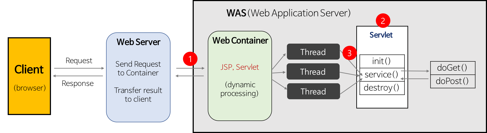

## 서블릿이란

> 서블릿이란 클라이언트의 요청을 받아 처리하고 처리한 요청을 클라이언트에게 다시 전송하는 기술이다. 이러한 서블릿은 웹서비스를 위한 자바 인터페이스(CGI, Common Gateway Interface)이다.

그렇기 때문에 서블릿을 쓴다는 것은 웹 서비스를 제공한다는 의미이다. 이러한 서블릿은 서블릿 컨테이너에 등록만 해주면 생명 주기를 서블릿 컨테이너가 관리해준다.

### 웹서버(Web Server)와 웹 애플리케이션서버(WAS, Web Application Server)

**웹서버**

- 웹서버란 클라이언트로부터 HTTP 요청을 받아 요청에 해당하는 응답을 주는 컴퓨터 프로그램
- 주로 정적인 페이지를 표현하기 위한 서버로서 정적 리소스(CSS, IMAGE 등)에 대해 WAS를 거치지 않고 사용자에게 직접 전달

**웹 애플리케이션 서버(WAS)**

- 클라이언트에게 동적 컨텐츠를 제공해주는 서버
- 쉽게 표현해서 비즈니스 로직을 처리하는 서버
- 트랜잭션, 보안, 트래픽관리, DB커넥션 풀, 사용자 관리 등 다양하고 강력한 기능을 제공
- 주로 자바 기반으로 Java EE 표준을 수용. But, Java EE 표준을 수용하지 않거나 .NET 같은 비 자바 계열도 존재

### 서블릿의 작성 방법

### Servlet 3.0 Spec 이상

- web.xml 파일을 사용하지 않고, 자바 어노테이션을 사용

### Servlet 3.0 Spec 미만

- web.xml 파일을 이용하여 등록

### 서블릿의 생명주기

1. WAS는 서블릿 요청을 받으면 해당 서블릿이 메모리에 있는지 확인
2. 없으면 서블릿 클래스를 메모리에 올림 → init 메소드 실행 → service 메소드 실행
3. WAS가 종료되거나, 웹 앱이 새롭게 갱신될 경우 destroy 메소드 실행

### 서블릿의 순서

### 서블릿 프로그램의 동작 과정

1. 클라이언트에서 요청을 한다.
2. 정적/동적 컨텐츠인지 확인 후, 동적 컨텐츠일 경우 WAS 서버 요청(Web Container or Servlet Container 에게 위임)
3. Servlet Container는 서블릿 요청을 받으면 요청을 처리할 적절한 Servlet이 메모리에 있는지 확인. 만약 메로리에 없다면 메모리에 올림
4. 메모리에 로드될 때, Servlet 객체를 초기화 하는 init 메소드 실행
5. service 메소드를 실행